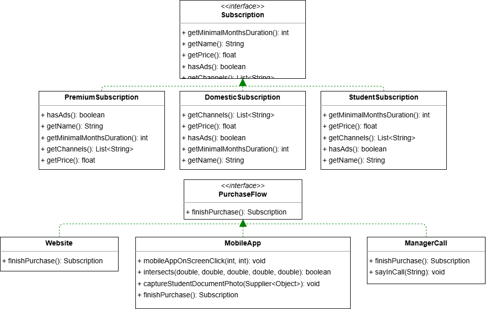
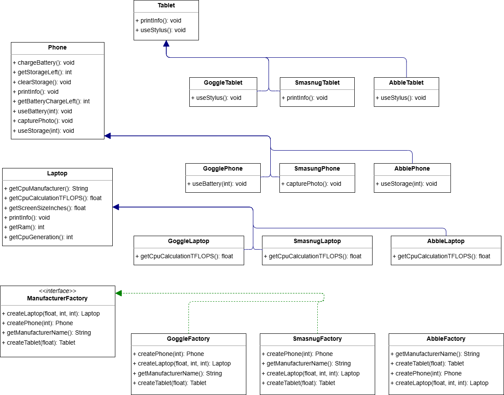
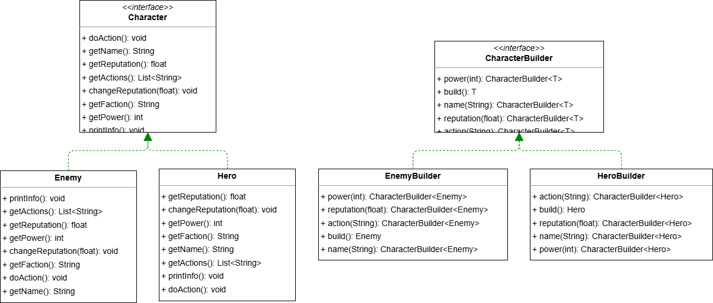

# Lab 2

## Patterns used in code

### 1. Factory method

Each `PurchaseFlow` sublass has different logic for purchasing subscription. 
`Website` accepts input stream (possibly from console) with user data 
`MobileApp` requires user to "click" on a screen to select subscription type and make photo of student document for student subscription 
`ManagerCall` requires telling manager what subscription you want and specify student document id for student subscription 

### 2. Abstract factory

Each `ManufacturerFactory` implementation can create all devices   
Manufacturer created devices will have different features and specs depeding on manufacturer specific extension of `Laptop` `Phone` and `Tablet` 

### 3. Singleton

Only one instance of `Authenticator` class can be created and used in all threads 
Constructor has private visibility ensure creation object can be only done in static methods of this class 
Constructor and `getInstance` method contain checks to ensure only one object can be created even in multithreaded environment 
Creation of `Authenticator` is deferred to first call of `getInstance` method 

### 4. Prototype

`Virus` implements method `duplicate` from `Prototype` interface 
`duplicated` method implementation copies all fields from original to new object, and recursively duplicates each child from childen list  

### 5. Builder

`Character` interface defines what any character can do 
`CharacterBuilder` interface defines how character is created 

`HeroBuilder` and `EnemyBuilder` implement `CharacterBuilder` with different way of passing data to result character; 
`Hero` and `Enemy` implement `Character` with different ways to store data; 

